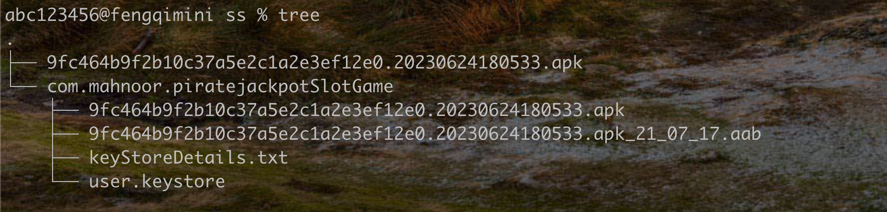

# apk转化aab格式
 

### 使用流程

* 运行环境 python3.10 +

* 安装需要的环境

    ```shell
    pip install -r requirements.txt
    ```

* 普通默认直接执行命令生成aab 

    ```shell
    python3.10 bundletool.py -i test.apk -o test.aab
    ```
* 普通默认带证书直接执行命令生成aab 

    ```shell
    python3.10 bundletool.py -i /Users/abc123456/Documents/ios/build_aab_tool/ss/com.mahnoor.piratejackpotSlotGame/9fc464b9f2b10c37a5e2c1a2e3ef12e0.20230624180533.apk -o /Users/abc123456/Documents/ios/build_aab_tool/ss/com.mahnoor.piratejackpotSlotGame/9fc464b9f2b10c37a5e2c1a2e3ef12e0.20230624180533.apk_21_07_17.aab  --keystore /Users/abc123456/Documents/ios/build_aab_tool/ss/com.mahnoor.piratejackpotSlotGame/user.keystore  --store_password BlackJackPoker1!@# --key_alias  BlackJackPoker  --key_password  BlackJackPoker1!@#

    ```
    

  参数说明:
    ```
      -h 
    
    ​		show this help message and exit
      -i 
    
    ​		输入apk的路径
      -o 
    
    ​		输出apk的路径
      --keystore 
    
    ​		签名文件路径
      --store_password 
    
    ​		签名文件路径
      --key_alias 
    
    ​		签名文件路径
      --key_password 
    
    ​		签名文件路径
      --apktool 
    
    ​		apktool.jar路径
      --aapt2 
    
    ​		aapt2路径
      --android 
    
    ​		android.jar 路径
      --bundletool 
    
    ​		bundletool.jar 路径
      --pad_reg 
    
    ​		正则表达式，从assets里面去剪切文件构建pad模块 例如: ^\d.*\.map$ 剪切以数字开头 .map 结尾的文件到pad目录
  ```


*  下载后的apk一键生成子目录，根据包名设置

    ```shell
    python3.11 genApkfolder.py ss
    ```



*  但是输入脚本太过于复杂，所以添加了一个自动查找签名识别证书的脚本，一键签名

    ```shell
    python3.11 signAllApks.py ss
    ```

 


### License

build_aab_tool is released under the [Apache 2.0 license](LICENSE).

```
Copyright 2021 

Licensed under the Apache License, Version 2.0 (the "License");
you may not use this file except in compliance with the License.
You may obtain a copy of the License at

    http://www.apache.org/licenses/LICENSE-2.0

Unless required by applicable law or agreed to in writing, software
distributed under the License is distributed on an "AS IS" BASIS,
WITHOUT WARRANTIES OR CONDITIONS OF ANY KIND, either express or implied.
See the License for the specific language governing permissions and
limitations under the License.
```
